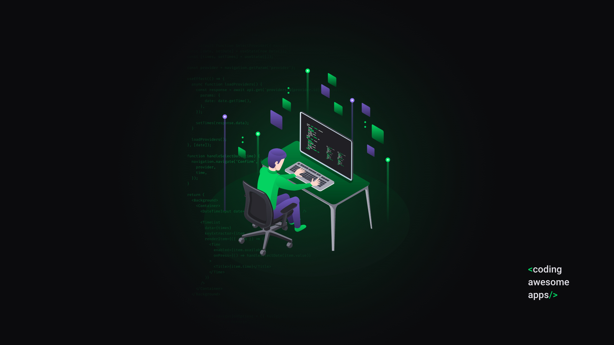

<h1 align="center"> <strong> Semana Omnistack 11.0 </strong> </h1>

  </img>

 

Projeto <strong>BE THE HERO</strong> - Rocketseat

  </img>

  <a aria-label="Versão do Node" href="https://github.com/nodejs/node/blob/master/doc/changelogs/CHANGELOG_V12.md#12.16.1">
    </img>
  </a>

  <a aria-label="Versão do React" href="#">
    </img>
  </a>
  
  <!--<a aria-label="Versão do Expo" href="#">
    </img>
  </a>--> 
    
  <a aria-label="Rocketseat" href="#">
    </img>
  </a>
  <!--
  <a aria-label="License" href="#">
    </img>
  </a> -->
  

  <a href="#rocket-tecnologias">Tecnologias</a>&nbsp;&nbsp;&nbsp;|&nbsp;&nbsp;&nbsp;
  <a href="#-projeto">Projeto</a>&nbsp;&nbsp;&nbsp;|&nbsp;&nbsp;&nbsp;
  <a href="#-layout">Layout</a>&nbsp;&nbsp;&nbsp;|&nbsp;&nbsp;&nbsp;
  <a href="#memo-licença">Licença</a>

## Em Desenvolvimento